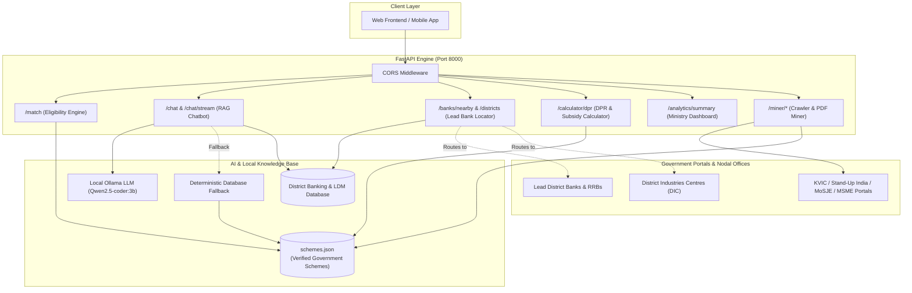

# SIH26092: AI-Driven Scheme Matching & Enterprise Advisory Engine

[](https://www.python.org/)
[](https://fastapi.tiangolo.com/)
[-orange.svg)](https://ollama.ai/)
[](tests/)
[](LICENSE)

> **Smart India Hackathon (SIH) Problem Statement:** AI-powered platform for identifying, matching, and facilitating welfare and credit-linked enterprise schemes for marginalized entrepreneurs (SC, ST, OBC, Women, Minorities, Artisans, and PwD) under the **Ministry of Social Justice & Empowerment (MoSJE)** and **Ministry of MSME**.

---

## 🌟 Key Capabilities

1. **Multi-Constraint Demographic Scheme Matching (`POST /match`)**
   - Evaluates applicant criteria against verified central and state schemes: **Category, Annual Income Ceiling, Project Cost, Age Limits, Gender, Occupation, and State**.
   - Provides clear diagnostic **ineligibility reasons** (e.g., *"Income ₹4,00,000 exceeds scheme limit of ₹3,00,000"* or *"Age 55 exceeds upper limit of 50 years"*).

2. **RAG Scheme Advisory Chatbot with Real-Time Streaming (`POST /chat`, `POST /chat/stream`)**
   - Powered by local **Ollama (`qwen2.5-coder:3b`)** with zero external API fees and total privacy.
   - **Zero-Failure Fallback Guarantee**: If Ollama times out or is offline, the chatbot automatically synthesizes verified database facts—the user interface **never receives an error or blank response**.
   - **Real-Time Token Streaming**: Streams responses via Server-Sent Events (SSE) with sub-2-second latency.
   - **Multilingual / Hindi Support**: Automatically parses queries in English or Devanagari Hindi (e.g., *"वाराणसी में सिलाई का व्यवसाय"*).

3. **District Lead Bank & Nodal Agency Locator (`GET /banks/nearby`, `GET /banks/districts`)**
   - Automatically maps the applicant's **State and District** to their designated **RBI Lead District Bank (LDB)**, **Lead District Manager (LDM) office**, **Regional Rural Banks (RRBs)**, and **District Industries Centre (DIC)**.
   - Informs the applicant which branch desk to visit, what documents to bring, and how to escalate delays.

4. **1-Click Detailed Project Report (DPR) & Financial Subsidy / EMI Calculator (`POST /calculator/dpr`)**
   - Solves the primary cause of rural loan rejections: lack of a project cost sheet.
   - Computes:
     - **Beneficiary Margin Money**: 5% for SC/ST/Women/OBC vs. 10% for General.
     - **Government Capital Subsidy**: Up to 35% in rural areas under PMEGP.
     - **Bank Loan Split**: Partitioned into Term Loan (Machinery/CapEx) and Working Capital.
     - **Monthly EMI Schedule**: Amortization schedules across 3, 5, or 7-year repayment tenures.
     - **Bank Interview Checklist**: Pre-generates the required documentation list.

5. **Automated Batch Web Crawler & PDF Miner (`/miner/*`)**
   - Pre-seeded catalog of 16+ verified central & state portals ([`app/miner/source_catalog.py`](app/miner/source_catalog.py)).
   - Discovers circulars, extracts text from embedded guideline PDFs, and uses heuristics/LLM extraction to populate structured schemes automatically.

6. **Ministry Policy & Demand Analytics Dashboard (`GET /analytics/summary`)**
   - Computes live demographic coverage percentages, Ministry breakdowns, loan cap averages, and policy insights for MoSJE/MSME evaluators.

7. **Universal Frontend Integration**
   - **CORS enabled** out of the box for React (`localhost:3000`), Vite (`localhost:5173`), Next.js, and Flutter.

---

## 🏛️ Architecture Overview



---

## 🚀 Quickstart

### Prerequisites
- **Python 3.10+**
- **Ollama** (optional for AI Chat, recommended):
  ```bash
  curl -fsSL https://ollama.ai/install.sh | sh
  ollama serve
  ollama pull qwen2.5-coder:3b
  ```
  *(If Ollama is not installed or offline, the backend seamlessly operates with its built-in rule-based database fallback.)*

### One-Command Startup
Clone the repository and launch:
```bash
git clone https://github.com/your-team/sih-backend.git
cd sih-backend
./start.sh
```

The script will automatically:
1. Detect or create a virtual environment (`.venv`).
2. Install dependencies from `requirements.txt`.
3. Check Ollama connectivity and model availability.
4. Export CPU hardware multithreading optimizations.
5. Launch the FastAPI server with live reload at **`http://localhost:8000`**.

Interactive API Documentation:
- **Swagger UI**: [http://localhost:8000/docs](http://localhost:8000/docs)
- **ReDoc**: [http://localhost:8000/redoc](http://localhost:8000/redoc)

---

## 🧪 Running Automated Tests

Run the complete 34-test suite covering matching, RAG chat, streaming, banking, DPR calculator, and analytics:

```bash
# Activate virtualenv
source .venv/bin/activate

# Run pytest with verbose output
pytest -v
```

Expected output:
```text
======================== 34 passed, 1 warning in 48.58s ========================
```

---

## 📡 API Reference & cURL Examples

### 1. Match Applicant Profile (`POST /match`)
Evaluates an applicant against all indexed schemes and returns matched schemes + ineligibility diagnostics.

```bash
curl -X POST "http://localhost:8000/match" \
     -H "Content-Type: application/json" \
     -d '{
       "category": "SC",
       "annual_income": 180000,
       "project_cost": 1500000,
       "age": 32,
       "gender": "Female",
       "occupation": "Artisan",
       "state": "Uttar Pradesh"
     }'
```

---

### 2. AI Scheme Advisory Chatbot (`POST /chat`)
Provides multi-turn RAG advice. Automatically extracts location from the text or parameters and includes designated Lead Bank details.

```bash
curl -X POST "http://localhost:8000/chat" \
     -H "Content-Type: application/json" \
     -d '{
       "message": "I am a 32 year old SC woman in Varanasi, UP starting a tailoring unit with 15 lakhs cost. What scheme is best and which banks nearby will provide the loan?",
       "history": []
     }'
```

#### Real-Time Streaming (`POST /chat/stream`)
For real-time UI typing animations without timeouts:
```bash
curl -X POST "http://localhost:8000/chat/stream" \
     -H "Content-Type: application/json" \
     -d '{"message": "What is the capital subsidy in PMEGP for rural women?"}'
```

---

### 3. Nearby Bank & District Nodal Locator (`GET /banks/nearby`)
Returns designated Lead District Bank (LDB), Regional Rural Banks (RRBs), LDM office, and application procedures.

```bash
curl "http://localhost:8000/banks/nearby?scheme_code=STANDUP-INDIA&state=Uttar%20Pradesh&district=Varanasi"
```

Response snippet:
```json
{
  "state": "Uttar Pradesh",
  "district": "Varanasi",
  "scheme_name": "Stand-Up India Scheme",
  "lead_bank_name": "Union Bank of India",
  "ldm_office_info": "Lead District Manager (LDM) Office, Union Bank Bhawan, Sigra / Kachehri, Varanasi",
  "primary_lending_banks": [
    {
      "bank_name": "Union Bank of India",
      "category": "Designated Lead District Bank (LDB)",
      "branch_desk": "MSME / Priority Sector Lending Desk, Main Branch, Varanasi"
    }
  ],
  "regional_rural_banks": [
    { "bank_name": "Baroda UP Bank", "category": "Regional Rural Bank (RRB)" }
  ],
  "district_nodal_offices": [
    {
      "agency": "Lead District Manager (LDM) Office",
      "location": "Union Bank Bhawan, Sigra / Kachehri, Varanasi",
      "role": "Monitors mandatory branch quota: Every commercial bank branch must sanction at least 1 SC/ST and 1 Woman greenfield project."
    }
  ]
}
```

---

### 4. Detailed Project Report (DPR) & Subsidy / EMI Calculator (`POST /calculator/dpr`)
Generates bank appraisal financial breakdowns, margin money %, subsidy, and monthly EMI schedule.

```bash
curl -X POST "http://localhost:8000/calculator/dpr" \
     -H "Content-Type: application/json" \
     -d '{
       "project_cost": 1500000,
       "scheme_code": "PMEGP",
       "category": "SC",
       "is_rural": true,
       "tenure_years": 5
     }'
```

Response:
```json
{
  "scheme_code": "PMEGP",
  "scheme_name": "Prime Minister’s Employment Generation Programme (PMEGP)",
  "total_project_cost": 1500000.0,
  "own_contribution_rate_pct": 5.0,
  "own_contribution_amount": 75000.0,
  "subsidy_rate_pct": 35.0,
  "subsidy_amount": 525000.0,
  "bank_loan_amount": 1425000.0,
  "term_loan_estimate": 997500.0,
  "working_capital_estimate": 427500.0,
  "annual_interest_rate_pct": 9.0,
  "emi_details": {
    "tenure_years": 5,
    "monthly_emi": 29580.66,
    "total_interest": 349839.6,
    "total_payment": 1774839.6
  },
  "collateral_requirement": "Strictly collateral-free for projects up to ₹10 Lakhs (covered under CGTMSE without collateral)."
}
```

---

### 5. Ministry Policy Analytics (`GET /analytics/summary`)
Returns demographic distributions, coverage rates, and policy insights.

```bash
curl "http://localhost:8000/analytics/summary"
```

---

### 6. Automated Batch Crawler (`POST /miner/crawl`)
Crawls configured central/state portals for new circulars and updates `schemes.json`.

```bash
curl -X POST "http://localhost:8000/miner/crawl" \
     -H "Content-Type: application/json" \
     -d '{"category": "Central", "follow_pdfs": true}'
```

---

## ⚙️ Hardware & Local LLM Optimization

The backend is engineered to run on standard laptop/workstation CPUs without requiring high-end dedicated GPUs:

- **CPU Multithreading (`num_thread: 8`)**: Evaluates prompts and generates tokens across all available physical/logical CPU cores.
- **Vulkan VRAM Protection (`num_gpu: 0`)**: Avoids out-of-device-memory errors on discrete/integrated graphics cards by executing cleanly on system RAM.
- **Prompt Compaction**: Restricts RAG scheme context to dense bullet points, keeping prompt evaluation fast (<1.5s).
- **Token Bounds (`num_predict: 250`)**: Prevents unbounded token runaway on non-streaming requests.

---

## 📂 Project Structure

```text
sih-backend/
├── app/
│   ├── main.py                     # FastAPI routes, CORS, and lifecycle
│   ├── models/                     # Database models
│   ├── schemas/
│   │   ├── applicant.py            # Applicant profile schema (includes state & district)
│   │   └── scheme.py               # Government scheme schema
│   ├── services/
│   │   ├── eligibility.py          # Multi-factor eligibility engine & ineligibility diagnostic
│   │   ├── ollama_service.py       # Ollama integration, thread optimization & streaming
│   │   ├── chatbot.py              # RAG Scheme Advisor Chatbot & zero-failure fallback
│   │   ├── bank_locator.py         # Lead District Bank, RRB & DIC locator (English + Hindi)
│   │   └── dpr_calculator.py       # DPR project cost, subsidy & EMI calculator
│   └── miner/
│       ├── source_catalog.py       # 16+ verified government scheme portals
│       ├── crawler.py              # Automated batch web crawler
│       ├── scheme_miner.py         # HTML and PDF document parser
│       └── scheme_extractor.py     # Heuristics & Ollama structured extraction
├── tests/
│   ├── test_api_and_miner.py       # API, upload & extraction tests
│   ├── test_banks.py               # Bank locator, LDM & location tests
│   ├── test_chatbot_and_crawler.py # Chatbot, RAG & crawler tests
│   └── test_dpr_and_analytics.py   # DPR calculator, analytics & CORS tests
├── schemes.json                    # Active database of verified government schemes
├── requirements.txt                # Python package dependencies
├── start.sh                        # Production / demo startup script
└── README.md                       # Documentation & API reference
```

---

## 👥 Team & Acknowledgments

Built for the **Smart India Hackathon (SIH)**.  
Sponsoring Ministry: **Ministry of Social Justice and Empowerment (MoSJE)** & **Ministry of Micro, Small and Medium Enterprises (MSME)**.
